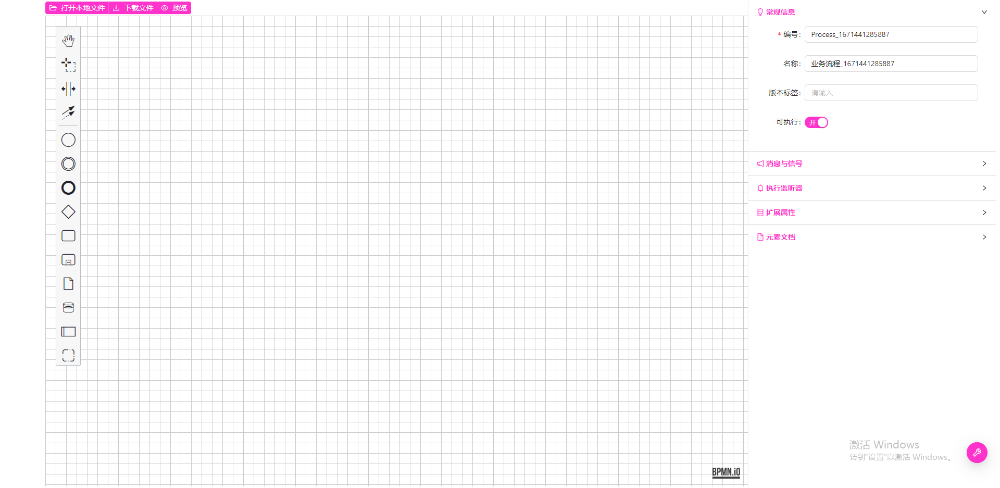
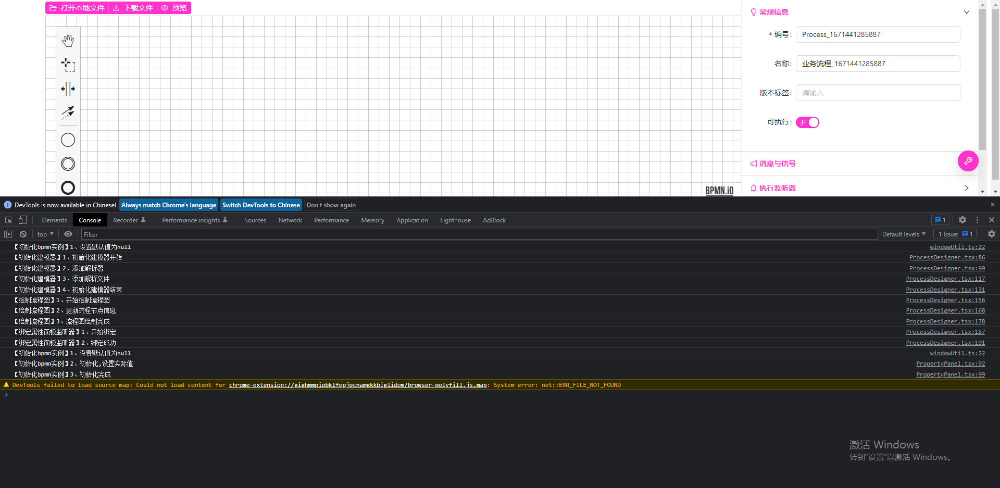
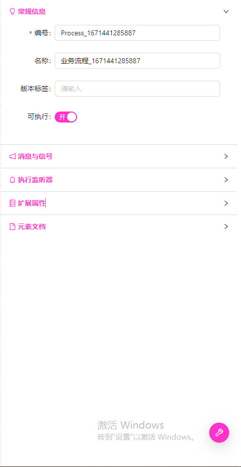

# react-bpmn


## :blush:项目概览


### 1、首页




### 2、控制台




### 3、右侧panel页




### 4、其它页面在开发后补全


## :calendar:更新日志


| 1、完成主页的基本集成，以及右侧自定义Panel :tada::tada::tada: | 2022-12-19 |
| ------------------------------------------------------------ | ---------- |
|                                                              |            |


## :rocket:快速启动 


```bash
$ yarn // 安装依赖
$ yarn start // 启动
```


## :book:项目说明


### 1、版本

由于1.0后的和1.0之前的属性面板有较大的改变，且相关的api名称或位置可能也有改变，因此，在这里说明一下当前项目集成的版本。（我使用的是目前最新版本）

```json
"bpmn-js": "^9.0.3",
"bpmn-js-properties-panel": "^1.0.0",
"camunda-bpmn-moddle": "^6.1.2",
```

版本变化说明：

> 参考：https://github.com/bpmn-io/bpmn-js-examples/tree/master/properties-panel-extension
>
> Extending the properties panel changed significantly with `bpmn-js-properties-panel>=1`. For the `0.x` version of the library, check out [the old version of this example](https://github.com/bpmn-io/bpmn-js-examples/tree/b20919ac2231abf3df45b9dc9a2561010009b4a2/properties-panel-extension). （ps ：1. 以后版本的属性面板与之前的有显著变化）


## :pencil:待解决问题


### 1、ts 中引入js 

ts不能直接引入js，所以在项目中进行了如下处理，但是这样处理后还有一个问题：bpmn相关的api在代码编辑器中没有提示出来，也不能点击跳转，暂未解决。


```javascript
declare module '*';
```


