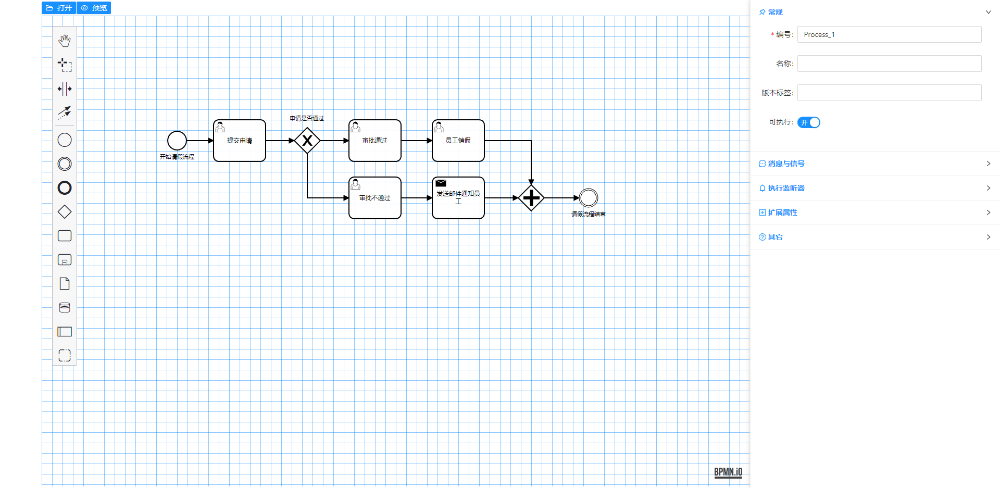
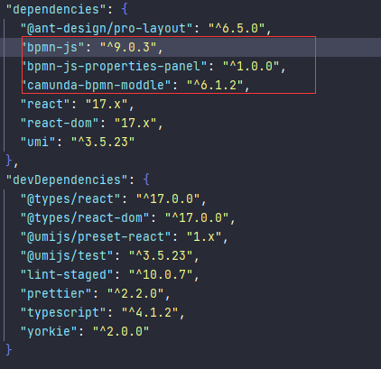

# react-bpmn

## 项目运行截图



## 更新概览

**目前项目仍在不定时更新中，请持续关注，前端集成bpmn-js一定会完成，请放心！**

1. 目前还在处理自定义属性面板的内容，由于前面部分写的代码传递的props过大，导致流程图加载或者更新会卡顿，现在已经采取全局引用的方式优化。
2. 对于想了解集成过程的小伙伴，需要等待这个项目大部分完成后，我会专门建一个doc文件夹用于说明集成过程。
3. 由于目前仍在公司上班，所以更新时快时慢，但是肯定是会做出来的。

## 快速启动

安装依赖

```bash
$ yarn
```

本地启动

```bash
$ yarn start
```

## 集成过程

### 版本说明

由于1.0后的和1.0之前的属性面板有较大的改变，且相关的api名称或位置可能也有改变，因此，在这里说明一下当前项目集成的版本。

**属性面板的变化：**

> 参考：https://github.com/bpmn-io/bpmn-js-examples/tree/master/properties-panel-extension
>
> Extending the properties panel changed significantly with `bpmn-js-properties-panel>=1`. For the `0.x` version of the library, check out [the old version of this example](https://github.com/bpmn-io/bpmn-js-examples/tree/b20919ac2231abf3df45b9dc9a2561010009b4a2/properties-panel-extension). （ps 翻译：1 以后版本的属性面板与之前的有显著变化）

**当前我使用的是官方最新版本。版本不同的同学仅作参考。**



### 依赖安装

```bash
npm install bpmn-js

npm install bpmn-js-properties-panel

npm install camunda-bpmn-moddle
```

## 报错汇总

### ts 中不能直接引入js 


```
declare module '*';
```

### 依赖找不到


解决：重新安装依赖即可。

```bash
npm install bpmn-js-properties-panel
```

### 属性面板扩展，官方示例报错

>官方示例：[bpmn-js-examples/properties-panel-extension at master · bpmn-io/bpmn-js-examples · GitHub](https://github.com/bpmn-io/bpmn-js-examples/tree/master/properties-panel-extension)

SpellProps.js 文件中，返回值使用标签的形式，会报错。

```js
  return <TextFieldEntry
    id={ id }
    element={ element }
    description={ translate('Apply a black magic spell') }
    label={ translate('Spell') }
    getValue={ getValue }
    setValue={ setValue }
    debounce={ debounce }
  />
```

解决：不使用标签的形式即可

```js
  return TextFieldEntry({
    id: id,
    label: translate ? 'Spell' : '魔法值',
    element,
    description: translate ? 'Apply a black magic spell' : '施展一个黑魔法',
    getValue,
    setValue,
    debounce,
  });
```


