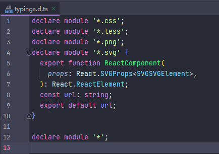
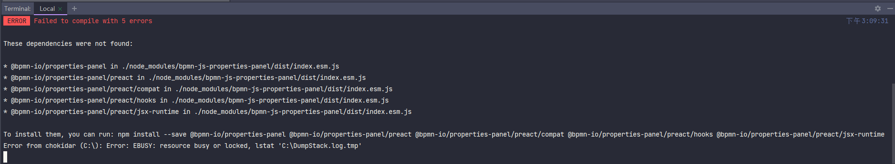

# react-bpmn

## Getting Started

Install dependencies,

```bash
$ yarn
```

Start the dev server,

```bash
$ yarn start
```

## 依赖安装

```bash
npm install bpmn-js

npm install bpmn-js-properties-panel

npm install camunda-bpmn-moddle
```

## ts中的js报错解决



```
declare module '*';
```

## 属性面板的变化

https://github.com/bpmn-io/bpmn-js-examples/tree/master/properties-panel-extension

> Extending the properties panel changed significantly with `bpmn-js-properties-panel>=1`. For the `0.x` version of the library, check out [the old version of this example](https://github.com/bpmn-io/bpmn-js-examples/tree/b20919ac2231abf3df45b9dc9a2561010009b4a2/properties-panel-extension).

1 以后版本的属性面板与之前的有显著变化

## 启动报错



解决：

重现安装依赖即可。

```bash
npm install bpmn-js-properties-panel
```

再次启动成功。


